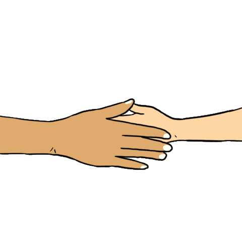

    

 

 

    
<h2>  Um pouco sobre mim </h2>

    
 Estudante de Análise e Desenvolvimento de Sistemas na FIAP!

    
    <h3>   Um pouco mais de detalhes: </h3>
    <ul>
        <li><a>&nbsp; Estudando para ser programador.</a></li> 
        <li><a>&nbsp; Estou sempre aprendendo algo novo.</a></li> 
        <li><a>&nbsp; Sou apaixonado por esportes.</a></li> 
        <li><a>&nbsp; Sou ativo em eventos e projetos de TI.</a></li> 
    </ul>
 

##

<h2 > Contato </h2>

    
 

  
   
  
  

  

##

    
<h2> Linguagens e Ferramentas </h2>

    

 
    
    
    
    
    
    
    

    

##

 

